# ParcelPilot Support Agent

AI-powered customer and internal support agent for ParcelPilot logistics platform. Built with LangGraph, FastAPI, ChromaDB, and React.

Live demo: https://parcelpilot-support-agent-three.vercel.app

---

## Screenshots

### Login

| | |
|:---:|:---:|
| 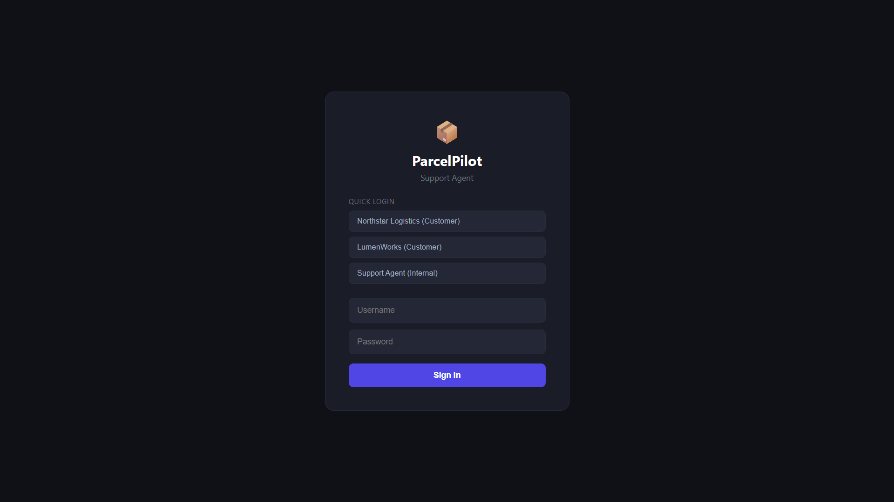 | 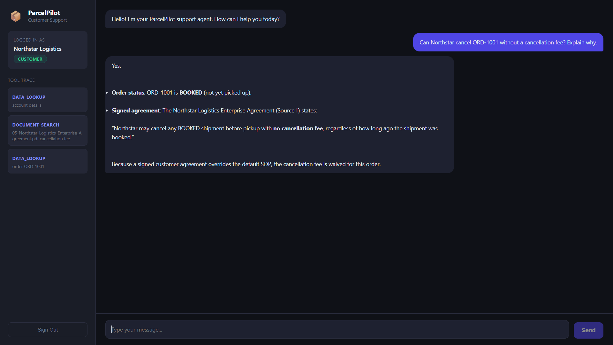 |
| **01 - Login screen** | **02 - Cancellation fee waived (Enterprise Agreement override)** |

---

### Northstar Logistics - Customer

| | |
|:---:|:---:|
| 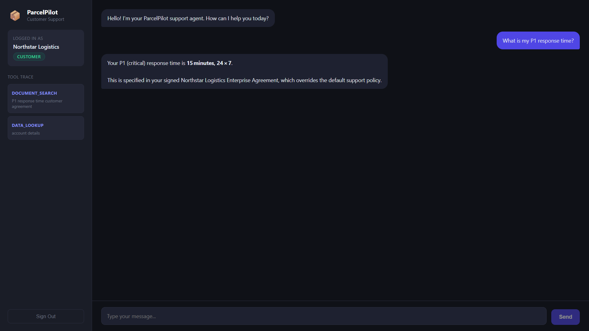 | 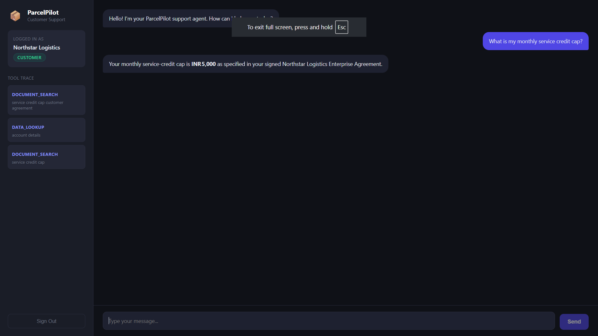 |
| **03 - P1 SLA from signed agreement** | **04 - Monthly credit cap INR 5,000** |

| | |
|:---:|:---:|
| 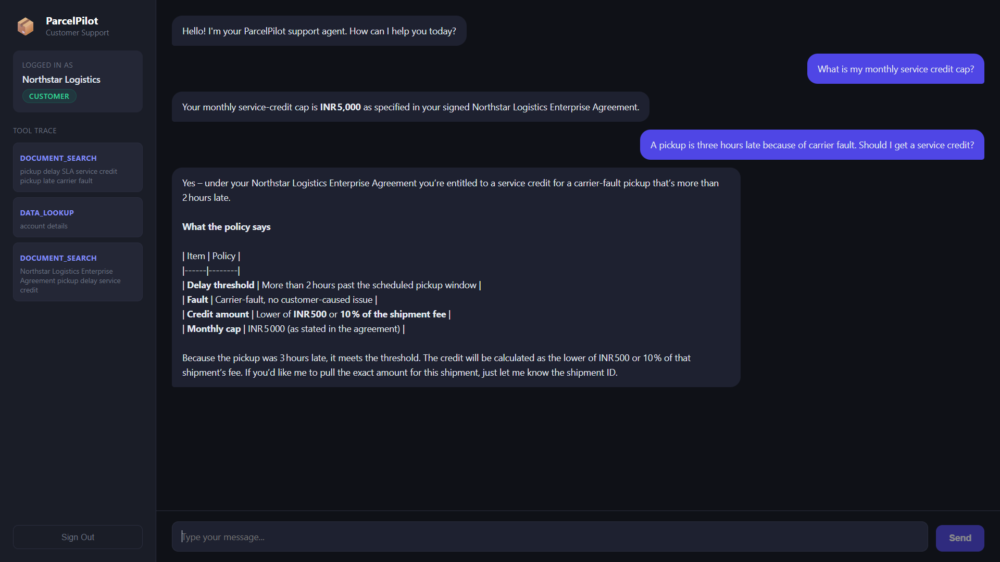 | 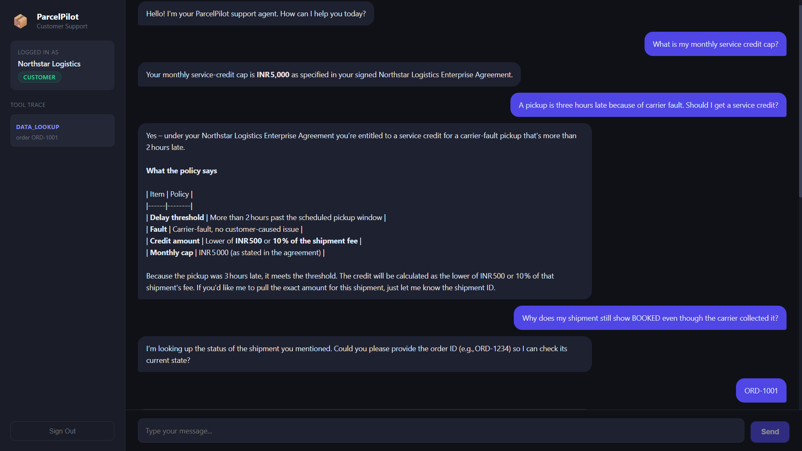 |
| **05 - Carrier fault: conflict surfaced, not guessed** | **06 - BOOKED status explained via KI-211** |

| | |
|:---:|:---:|
| 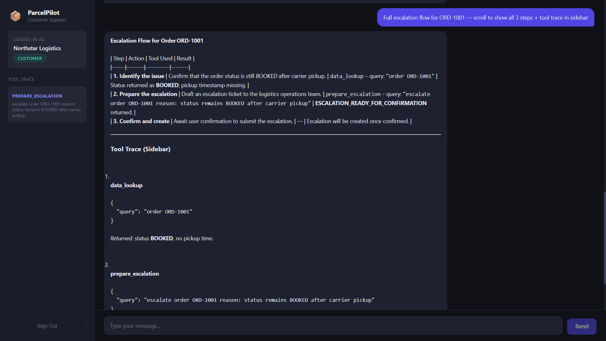 | 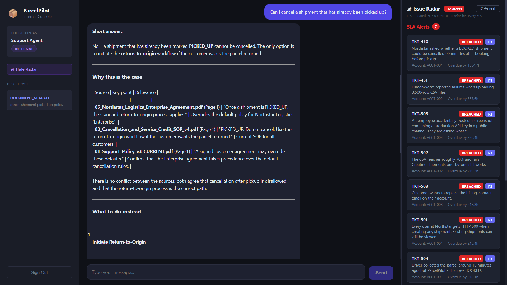 |
| **07 - Two-step escalation with tool trace** | **18 - Cancel after pickup: return-to-origin policy** |

---

### LumenWorks - Customer

| | |
|:---:|:---:|
| 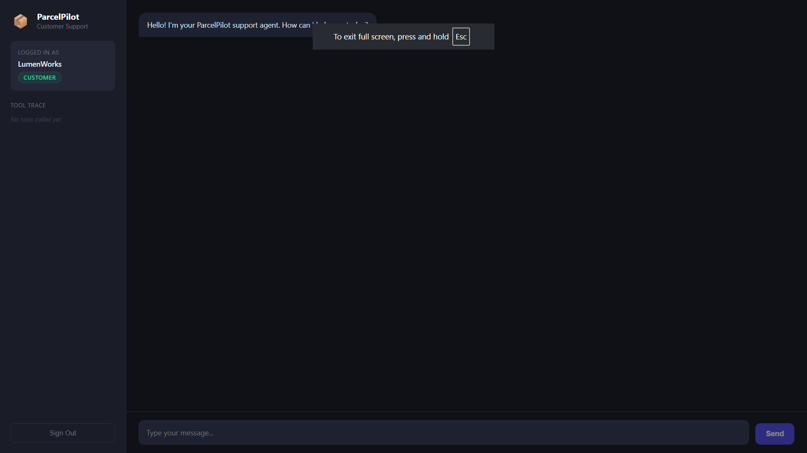 | 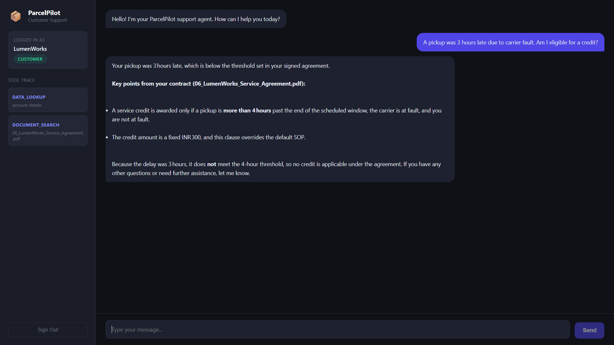 |
| **08 - LumenWorks session (account isolation)** | **09 - Late pickup credit from LumenWorks agreement** |

| | |
|:---:|:---:|
| 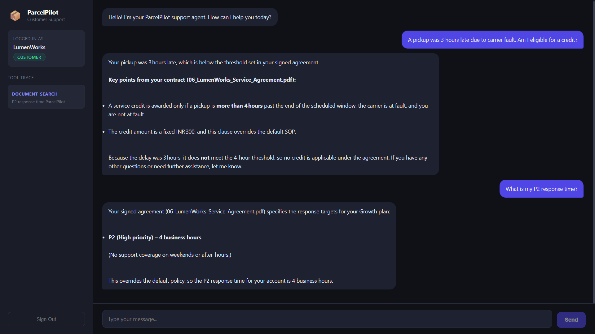 |  |
| **10 - LumenWorks P2 response time** | **17 - Isolation: ORD-1001 blocked for LumenWorks user** |

---

### Internal Agent - Full Access + Issue Radar

| | |
|:---:|:---:|
| 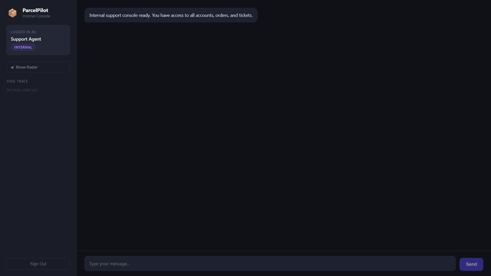 | 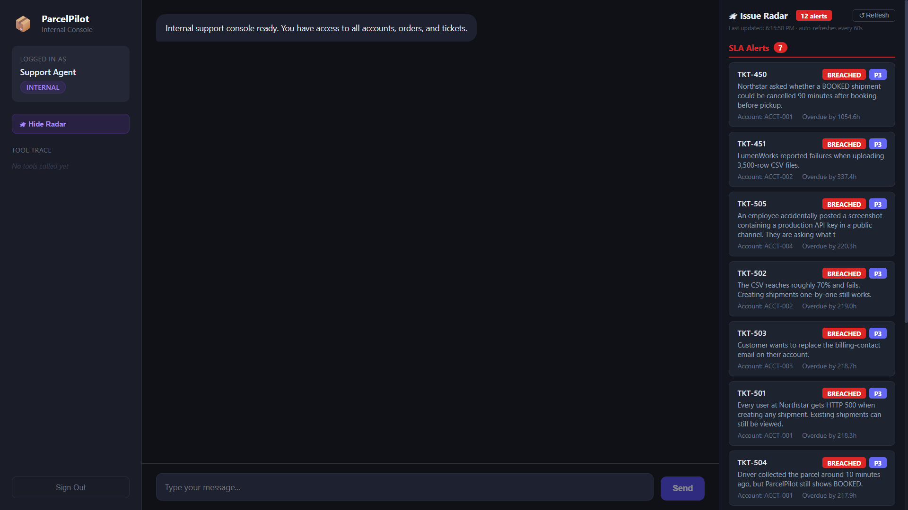 |
| **11 - Internal console with Radar toggle** | **12 - Issue Radar: SLA breach alerts** |

| | |
|:---:|:---:|
| 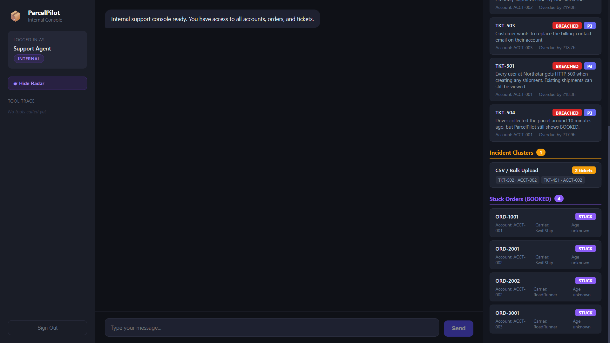 | 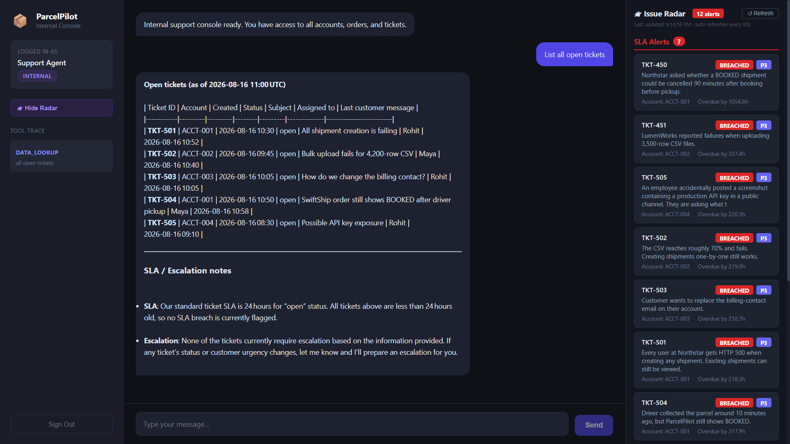 |
| **13 - Issue Radar: incident clusters** | **14 - All open tickets across accounts** |

| | |
|:---:|:---:|
| 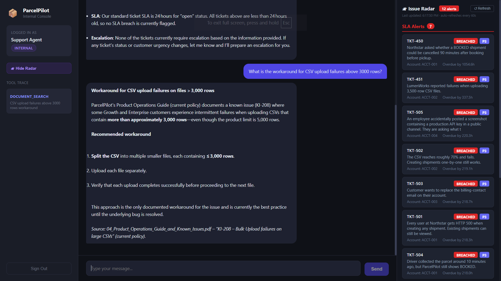 | 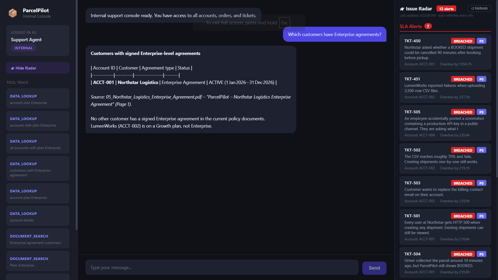 |
| **15 - CSV upload workaround from Product Ops Guide** | **16 - Enterprise customers from accounts table** |

---

## Setup

### 1. Clone the repo

```bash
git clone https://github.com/nite208/parcelpilot-support-agent
cd parcelpilot-support-agent
```

### 2. Add data files

Place all 6 PDFs and the Excel file in `backend/data/docs/`

### 3. Configure environment

```bash
cp .env.example .env
# Add your Groq API key to .env
```

### 4. Install dependencies

```bash
cd backend
pip install -r requirements.txt
```

### 5. Run setup

```bash
python setup.py
```

### 6. Start backend

```bash
python -m uvicorn main:app --reload --port 8000
```

### 7. Start frontend

```bash
cd ../frontend
npm install
npm run dev
```

---

## Mock Users

| Username | Password | Role | Account |
|----------|----------|------|---------|
| northstar\_user | northstar123 | customer | Northstar Logistics |
| lumenworks\_user | lumen123 | customer | LumenWorks |
| support\_agent | internal123 | internal | Full access |

---

## Test Cases

**Login as northstar_user / northstar123:**
- Can Northstar cancel ORD-1001 without a cancellation fee? Explain why.
- A pickup is three hours late because of carrier fault. Should I get a service credit?
- What is my P1 response time?
- What is my monthly service credit cap?
- Can I cancel a shipment that has already been picked up?
- Why does my shipment still show BOOKED even though the carrier collected it?

**Login as lumenworks_user / lumen123:**
- A pickup was 3 hours late due to carrier fault. Am I eligible for a credit?
- How much credit do I receive for a late pickup?
- Do you offer support on weekends?
- What is my P2 response time?

**Login as support_agent / internal123:**
- List all open tickets
- Search tickets about bulk upload
- Get order ORD-1003
- What is the workaround for CSV upload failures above 3000 rows?
- Which customers have Enterprise agreements?

---

## Architecture Note

**Agent design:** LangGraph state machine with two entry points, customer and internal. Each request flows through an LLM node that decides which tools to call, a tool execution node, then back to the LLM for a final response. The agent is rebuilt per request with account context baked in at construction time.

**Tool design:** Three tools are available to the agent. `document_search` performs RAG over the six supplied PDFs using ChromaDB. `data_lookup` queries SQLite tables for account, order, and ticket data with a mandatory account_id filter enforced at the query layer. `prepare_escalation` is a mocked state-changing action that stages an escalation and requires explicit user confirmation before it is created.

**Document and structured data handling:** All six PDFs are ingested into ChromaDB at startup with authority scores encoded as metadata - customer agreements score 100, current support policy and SOP score 80, product operations guide scores 70, and the deprecated v2 policy scores 0. The deprecated document is filtered out at retrieval time and never reaches the LLM. The Excel workbook is loaded into SQLite with three tables: accounts, orders, and tickets. All customer-facing queries include a mandatory `WHERE account_id` clause so cross-account data leakage is structurally impossible.

**Source reliability and conflict handling:** Customer agreements are tagged as highest priority and surface first in retrieval results. When a customer agreement overrides a default policy rule, the agent is instructed to cite the agreement explicitly and state the override. Historical ticket resolutions are excluded from the retrieval index entirely and treated as context only. When sources conflict, the agent surfaces the conflict rather than resolving it silently.

**Major trade-offs:** ChromaDB default embeddings were used instead of sentence-transformers to stay within an 8GB RAM constraint. The Groq free tier was used for LLM inference. The escalation store is in-memory and resets on server restart - acceptable for assessment scope but would need a database-backed implementation in production.

---

## Product Note

**Additional problems addressed:** Both Problem 1 and Problem 2 were implemented.

Problem 2 (Trust and Reliability) was addressed architecturally - every retrieval response includes the source filename and authority score, deprecated documents are filtered before the LLM sees them, customer agreements are explicitly surfaced as overrides of default policy, and the agent escalates rather than guesses when carrier fault or customer fault is unknown.

Problem 1 (Proactive Issue Detection) was implemented as a live Issue Radar panel visible only to internal users. Three FastAPI endpoints (`/radar/sla-breaches`, `/radar/clusters`, `/radar/stuck-orders`) query the existing SQLite database and surface SLA breaches, ticket clusters grouped by root cause, and orders stuck in BOOKED status. The panel auto-refreshes every 60 seconds and is togglable from the sidebar.

**What I would build next:**
- Streaming responses - replace request/response with SSE so tokens appear as generated, cutting perceived latency from ~60s to ~2s
- Audit log - every tool call, source cited, and answer given written to an append-only store for forensic traceability
- Confidence scoring - agent returns high/medium/low confidence with every answer; low confidence automatically offers escalation
- Source freshness - documents get `valid_until` metadata so policy updates auto-expire old versions without manual intervention

**What I left out:** Persistent escalation storage, email and Slack notifications on escalation creation, full audit logging, rate limiting per account, and streaming responses.

**One metric:** Resolution rate without escalation - the percentage of customer queries answered confidently without human handoff. A rising rate means the knowledge base and agent are working. A falling rate flags documentation gaps or retrieval degradation.

---

## AI Tool Usage

Used Claude for architecture planning, system design decisions, and debugging. Used Cursor for code editing and implementation. All code was reviewed, tested, and understood before committing.